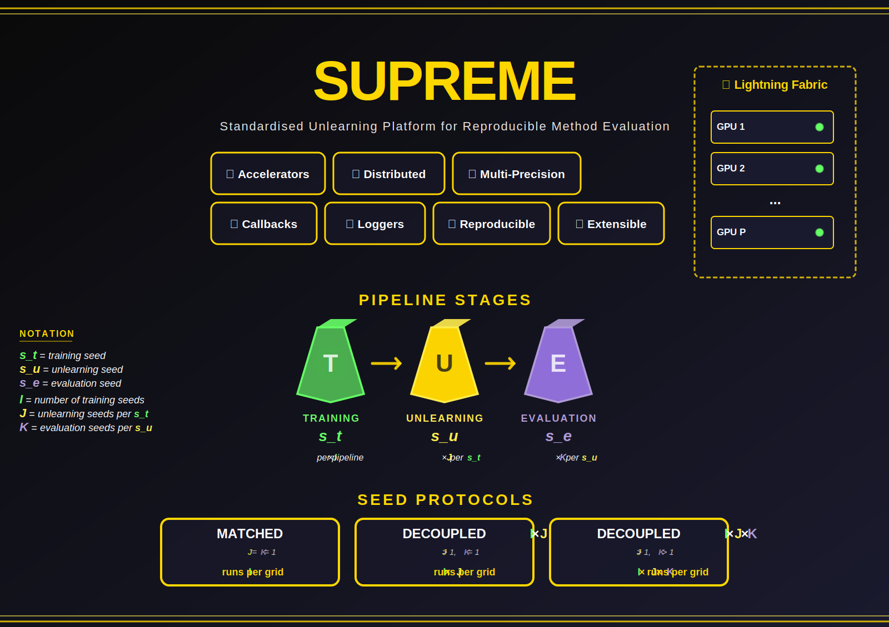

<div align="center">

<h3><strong>⚡ SUPREME - Standardised Unlearning Platform for REproducible Method Evaluation</strong></h3>



<p>
  <strong>🔬 Tech Stack</strong><br>
  <em>Core:</em>
  <a href="#"></a>
  <a href="https://pytorch.org/"></a>
  <a href="https://lightning.ai/docs/fabric/"></a>
  <a href="https://huggingface.co/docs/transformers/"></a>
  <br>
  <em>Accelerators:</em>
  <a href="https://developer.nvidia.com/cuda-toolkit"></a>
  <a href="https://developer.apple.com/metal/pytorch/"></a>
  <a href="https://pytorch.org/xla/"></a>
  <br>
  <em>Distributed & precision:</em>
  <a href="https://www.deepspeed.ai/"></a>
  <a href="https://huggingface.co/docs/bitsandbytes/"></a>
  <a href="https://github.com/NVIDIA/TransformerEngine"></a>
</p>

<p>
  <strong>🛠️ Tooling</strong><br>
  <em>Experiment tracking:</em>
  <a href="https://wandb.ai/"></a>
  <a href="https://www.tensorflow.org/tensorboard"></a>
  <br>
  <em>Environment:</em>
  <a href="https://www.docker.com/"></a>
  <a href="#"></a>
  <br>
  <em>Debug & profile:</em>
  <a href="https://github.com/microsoft/debugpy"></a>
  <a href="https://github.com/plasma-umass/scalene"></a>
  <br>
  <em>Code quality:</em>
  <a href="https://github.com/astral-sh/ruff"></a>
  <a href="https://pre-commit.com/"></a>
</p>

<p>
  <strong>📄 Publication</strong><br>
  <a href="https://arxiv.org/abs/2606.00380"></a>
  <a href="https://aiimlab.org/events/ECML_PKDD_2026_WIPE-OUT_2_Workshop_on_Machine_Unlearning_and_Privacy_Preservation.html"></a>
  <a href="https://pedroandreou.github.io/supreme-unlearning-page/"></a>
</p>

<p>
  <strong>📦 Repository</strong><br>
  <a href="LICENSE"></a>
</p>

</div>

---

## 📖 Overview

**SUPREME** is an open-source framework for evaluating *machine unlearning* methods on image classification tasks.

**What is machine unlearning?** Given a model that was trained on some data, machine unlearning removes the influence of a chosen subset of that data (a class, a sub-class, or a random sample of examples) *without* retraining the model from scratch. Doing this well is hard: a good unlearned model should behave as if it had never seen the forgotten data, while still classifying everything else accurately. Many methods have been proposed, and they need a fair, repeatable way to be compared.

**What SUPREME does.** It runs the same three-stage pipeline end to end for any registered combination of dataset, model, unlearning method, and evaluation metric:

1. **Train** a baseline model on the full dataset.
2. **Unlearn** the chosen subset using the selected unlearning method.
3. **Evaluate** the unlearned model against a from-scratch *retrained* baseline (trained only on the data that was kept), using a configurable set of metrics that cover forgetting, utility, privacy, behavioural/parametric equivalence, and efficiency.

It ships ready-to-use implementations of **5 datasets, 2 model architectures, 11 unlearning methods, and 10 evaluation metrics**, all selectable through command-line flags.

**What makes SUPREME different:**

- **Reproducible by design.** Recent work has shown that single-seed unlearning results can misrepresent a method's true behaviour. SUPREME runs the same experiment under multiple seeds, independently for the training, unlearning, and evaluation stages, so you measure distributions, not point estimates. The number of seeds at each stage is configurable per run.
- **Multi-GPU and multi-precision.** Built on PyTorch and Lightning Fabric. Distribution (DDP, FSDP, DeepSpeed ZeRO 1/2/3) applies to *all three stages*, with mixed-precision (fp16 / bf16) and NVIDIA / Apple Silicon / CPU back-ends.
- **Registry-based extensibility.** Add a dataset, model, unlearning method, or metric by implementing a small interface and registering its module path, with no framework changes required (see [`docs/extending.md`](docs/extending.md)).
- **Efficient.** When several experiments share the same training configuration, the model is trained once and reused across them, guarded by a file lock so parallel SLURM jobs and concurrent local runs stay consistent.

For the formal pipeline algorithm and mathematical notation (seed formulas, set definitions, operation signatures), see [`supreme/README.md`](supreme/README.md) and [`docs/notation.md`](docs/notation.md).

---

## 🗃️ Available Components

Registry-based components are **user-extensible** - implement the relevant interface and register the module path, either in-tree or **from your own package** (runtime API or packaging entry points, no edits to SUPREME). See [`docs/extending.md`](docs/extending.md). The components provided via Lightning Fabric cover the supported hardware and execution configurations.

### Registry-based (user-extensible)

| Component | Available implementations |
|---|---|
| **Datasets** | [CIFAR-10](supreme/datasets/datasets.py), [CIFAR-20](supreme/datasets/datasets.py), [CIFAR-100](supreme/datasets/datasets.py), [PinsFaceRecognition](supreme/datasets/datasets.py), [Caltech-101](supreme/datasets/datasets.py) |
| **Models** | [ResNet18](supreme/models/ResNet18.py), [Vision Transformer (ViT)](supreme/models/ViT.py) |
| **Baselines** | [Retrain](supreme/methods/baselines/retrain.py), [Original](supreme/methods/baselines/original.py) |
| **Unlearning methods** | [Fine-Tuning (FT)](supreme/methods/unlearning_methods/finetune.py), [Bad Teacher (BadT)](supreme/methods/unlearning_methods/bad_teacher.py), [Random Labels (RL)](supreme/methods/unlearning_methods/random_labeling.py), [UNSIR](supreme/methods/unlearning_methods/unsir.py), [SSD](supreme/methods/unlearning_methods/ssd.py), [LFSSD](supreme/methods/unlearning_methods/lfssd.py), [ASSD](supreme/methods/unlearning_methods/assd.py), [SCRUB](supreme/methods/unlearning_methods/scrub.py), [JIT](supreme/methods/unlearning_methods/jit.py) |
| **Evaluation metrics** | [Accuracy](supreme/eval_metrics/accuracy.py), [Loss/Error](supreme/utils/training/training_utils.py), [ZRF](supreme/eval_metrics/zrf.py), [Activation Distance](supreme/eval_metrics/activation_distance.py), [JS-Divergence](supreme/eval_metrics/jsdiv.py), [Layer-wise Distance](supreme/eval_metrics/layerwise_distance.py), [Membership Inference Attack](supreme/eval_metrics/membership_inference_attack.py), [Completeness](supreme/eval_metrics/completeness.py), [Resource Consumption](supreme/eval_metrics/resource_consumption.py), [Time](supreme/eval_metrics/time.py) |
| **Unlearning scenarios** | Full-class, Subclass, Random sample |

> Paper-evaluated subset: Retrain, FT, BadT, RL, UNSIR, SSD, LFSSD. The remaining methods (ASSD, SCRUB, JIT) are experimental implementations that aren't in the paper's evaluation but can be selected via `--methods`.

### Provided via Lightning Fabric

| Component | Available implementations |
|---|---|
| **Accelerators** | [CPU](https://lightning.ai/docs/fabric/2.1.0/api/generated/lightning.fabric.accelerators.CPUAccelerator.html), [CUDA](https://lightning.ai/docs/fabric/2.1.0/api/generated/lightning.fabric.accelerators.CUDAAccelerator.html), [MPS](https://lightning.ai/docs/fabric/2.1.0/api/generated/lightning.fabric.accelerators.MPSAccelerator.html), [TPU](https://lightning.ai/docs/fabric/2.1.0/api/generated/lightning.fabric.accelerators.XLAAccelerator.html) |
| **Precision modes** | [64-true, 32-true, 16-mixed, bf16-mixed, 16-true, bf16-true](https://lightning.ai/docs/fabric/2.1.0/fundamentals/precision.html), [transformer-engine, transformer-engine-float16](https://lightning.ai/docs/fabric/2.1.0/api/generated/lightning.fabric.plugins.precision.TransformerEnginePrecision.html) (FP8), [nf4, nf4-dq, fp4, fp4-dq, int8, int8-training](https://lightning.ai/docs/fabric/2.1.0/api/generated/lightning.fabric.plugins.precision.BitsandbytesPrecision.html) |
| **Distributed strategies** | [DDP](https://lightning.ai/docs/fabric/2.1.0/api/generated/lightning.fabric.strategies.DDPStrategy.html), [FSDP](https://lightning.ai/docs/fabric/2.1.0/api/generated/lightning.fabric.strategies.FSDPStrategy.html), [DeepSpeed](https://lightning.ai/docs/fabric/2.1.0/api/generated/lightning.fabric.strategies.DeepSpeedStrategy.html) (ZeRO Stage 1/2/3) |
| **Loggers** | [Weights & Biases](https://docs.wandb.ai/guides/integrations/lightning), [TensorBoard](https://lightning.ai/docs/fabric/2.1.0/api/generated/lightning.fabric.loggers.TensorBoardLogger.html), [CSV](https://lightning.ai/docs/fabric/2.1.0/api/generated/lightning.fabric.loggers.CSVLogger.html) |

---

## ⚡ Quickstart

```bash
# 1. Clone
git clone https://github.com/pedroandreou/supreme-unlearning.git
cd supreme-unlearning

# 2. Set up environment - the Makefile is the single entry point: it creates the
#    venv (named `unlearning` by default; override with VENV=<name>), installs the
#    pinned deps + SUPREME (editable), and enables the git hook. (Prompts if it
#    already exists; pass ON_EXISTING=reuse to skip.)
make cuda                  # NVIDIA GPU (Linux / WSL2).  Apple Silicon / CPU: `make mps`
source unlearning/bin/activate

# 3. Configure W&B + HF tokens
cp .env.example .env
# edit .env with your WANDB_KEY, WANDB_USERNAME and HUGGING_FACE_HUB_TOKEN

# 4. Smoke test - one seed, one method, one dataset
bash supreme/run_local.sh \
  --gpu 0 --models ViT --training-seeds 260 \
  --methods retrain,finetune,ssd \
  --strategies random_ --datasets Cifar10 \
  --forget-percs 0.01
```

Full environment setup (Docker Dev Container, MPS prerequisites, etc.) is documented in [`docs/environment_setup.md`](docs/environment_setup.md). The Docker image is NVIDIA-only (Linux / WSL2); macOS users follow the virtual-env path above.

---

## 🧪 Running Experiments

The pipeline runs **train → unlearn → evaluate** automatically. Re-running is safe: per-stage outputs (training checkpoints, unlearning checkpoints, already-logged W&B results) are detected and skipped.

### Local (workstation, GPU server, interactive cluster node)

```bash
# All 10 seeds, all methods, all datasets - defaults
bash supreme/run_local.sh --gpu 0

# Filter the sweep
bash supreme/run_local.sh \
  --gpu 0,1 \
  --models ViT \
  --training-seeds 260,261,262 \
  --methods retrain,finetune,bad_teacher,ssd \
  --strategies fullclass,random_ \
  --datasets PinsFaceRecognition
```

| Flag | Description | Default |
|------|-------------|---------|
| `--gpu` | GPU ID(s) - `0` single, `0,1,2,3` multi-GPU | `0` |
| `--models` | `ResNet18`, `ViT` | both |
| `--training-seeds` | Comma-separated training seeds (outer loop, `I`). | `260`–`269` |
| `--unlearning-seeds` | Space-separated indices for `J` (e.g. `"0 1 2"` for `J=3`) | `"0"` (matched) |
| `--evaluation-seeds` | Space-separated indices for `K` | `"0"` (matched) |
| `--methods` | Unlearning methods to run | all 15 |
| `--strategies` | `fullclass`, `subclass`, `random_` | all |
| `--datasets` | Datasets to use | all 5 |
| `--forget-percs` | Forget % for `random_` strategy | `0.001`–`0.10` |

### SLURM (HPC, login node)

```bash
# Preview the grid (no submission)
./supreme/run_slurm.sh --dry-run

# Submit all experiments, max 12 concurrent jobs
./supreme/run_slurm.sh --max-concurrent 12

# Subset
./supreme/run_slurm.sh \
  --datasets Cifar10,Cifar20 \
  --models ViT \
  --training-seeds 260,261,262

# Multi-GPU DDP per job
./supreme/run_slurm.sh --gpus 4
```

Each submitted job runs one `(seed, dataset, model)` cell independently; cells run in parallel across the cluster. Distributed-strategy selection (DDP / FSDP / DeepSpeed) is documented in [`docs/implementation_notes.md → Distributed Strategies`](docs/implementation_notes.md#distributed-strategies).

---

## 🔁 Reproducing the paper

Reproducing the paper's numbers is a two-step process: run the experiment grid on Pins Face Recognition (both architectures, both scenarios, all 10 seeds) and then render the three paper LaTeX tables from the W&B-logged results using [`supreme/utils/wandb_utils/results_analysis/pins_paper_tables.ipynb`](supreme/utils/wandb_utils/results_analysis/pins_paper_tables.ipynb). The exact command, the table-rendering workflow, and the troubleshooting notes are documented in [`docs/reproducing_the_paper.md`](docs/reproducing_the_paper.md). For a runnable, step-by-step walkthrough (install → smoke test → full grid → tables → extending), see the notebook [`notebooks/reproduce_experiments.ipynb`](notebooks/reproduce_experiments.ipynb).

---

## ➕ Extending SUPREME

SUPREME is pip-installable (`pip install supreme-unlearning`, imported as
`supreme`) and reusable as a library.
Register your own components from your own package - no edits to framework code:

```python
import supreme

supreme.register_unlearning_method("mymethod", "my_pkg.mymethod")
supreme.register_model("MyNet", "my_pkg.models:MyNet")
supreme.register_dataset("MyDS", "my_pkg.data:MyDS",
                         root="/data/myds", class_dict={"cat": 0, "dog": 1})

supreme.run_unlearning(["-method", "mymethod", "-net", "MyNet",
                        "-dataset", "MyDS", "-seed", "260"])
```

A runnable, end-to-end walkthrough from an external user's point of view -
`pip install supreme-unlearning` then register your own method/metric/model/dataset - is in
the notebook [`notebooks/custom_components.ipynb`](notebooks/custom_components.ipynb).

Components can equivalently be advertised by an installed plugin package via
packaging entry points (`supreme.models`, `supreme.unlearning_methods`,
`supreme.metrics`, `supreme.plugins`). The public API (`supreme.register_*`,
`supreme.run_training`, `supreme.run_unlearning`, `supreme.project_config`) is
the supported surface; everything under `supreme.utils.*` is internal.

Adding a dataset, model, method, or metric follows a consistent register-and-implement pattern. Walkthroughs and Fabric-integration rules live in [`docs/extending.md`](docs/extending.md):

| What to add | Walkthrough |
|---|---|
| New dataset | [`docs/extending.md → Adding a new dataset`](docs/extending.md#adding-a-new-dataset) |
| New model | [`docs/extending.md → Adding a new model`](docs/extending.md#adding-a-new-model) |
| New unlearning method | [`docs/extending.md → Adding a new unlearning method`](docs/extending.md#adding-a-new-unlearning-method) |
| New evaluation metric | [`docs/extending.md → Adding a new evaluation metric`](docs/extending.md#adding-a-new-evaluation-metric) |

---

## 📚 Documentation

| Document | Covers |
|---|---|
| [`docs/notation.md`](docs/notation.md) | Symbol glossary - seeds, datasets, models, indices, counts |
| [`supreme/README.md`](supreme/README.md) | Formal algorithm specification (matched and decoupled protocols) |
| [`docs/environment_setup.md`](docs/environment_setup.md) | Virtual-env and Docker Dev Container setup, `.env` template, prerequisites |
| [`docs/reproducing_the_paper.md`](docs/reproducing_the_paper.md) | Single command for the paper's experiment grid plus the W&B-export-to-LaTeX-tables workflow |
| [`docs/script_arguments.md`](docs/script_arguments.md) | Full argument reference for `train_main.py` and `unlearn_main.py` |
| [`docs/extending.md`](docs/extending.md) | How to add new datasets, models, methods, and metrics |
| [`docs/tooling.md`](docs/tooling.md) | Debugger, profiler, Fabric callbacks, process tracker, split export, W&B exporter |
| [`docs/wandb_integration.md`](docs/wandb_integration.md) | W&B runtime behaviour: rank-0 logging, offline mode, sync workflow, metric synchronisation |
| [`docs/wandb_fields.md`](docs/wandb_fields.md) | Paper-to-W&B metric mapping and per-metric field paths |
| [`docs/implementation_notes.md`](docs/implementation_notes.md) | Distributed strategies, gradient handling, batch-size scaling, memory, known limitations |
| [`docs/adding_pinsfacerecognition.md`](docs/adding_pinsfacerecognition.md) | Manual Kaggle download for the Pins Face Recognition dataset |
| [`docs/future_work.md`](docs/future_work.md) | Planned extensions |

---

## 📝 Citing this work

```bibtex
@misc{supreme2026,
  title  = {SUPREME: Standardised Unlearning Platform for REproducible Method Evaluation},
  author = {Petros Andreou, Jamie Lanyon, Axel Finke, Georgina Cosma},
  year   = {2026},
  eprint = {2606.00380},
  archivePrefix = {arXiv},
  primaryClass = {cs.LG},
  url    = {https://arxiv.org/abs/2606.00380}
}
```

This work was conducted at [Loughborough University](https://www.lboro.ac.uk/).

<p>
  <a href="https://www.lboro.ac.uk/"></a>
</p>

---

## 📄 License

Released under the [MIT License](LICENSE).
