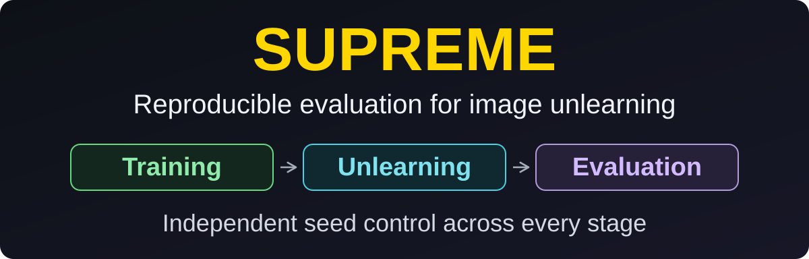
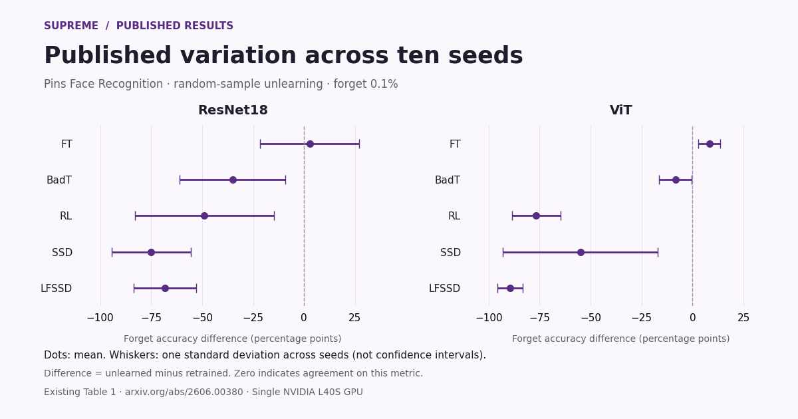

<div align="center">



<h2>Evaluate unlearning beyond a single trained model.</h2>

Control training, unlearning and evaluation seeds separately. Compare methods
against retraining, from one GPU to a cluster, through an extensible Python API.

<p>
  <a href="https://pedroandreou.github.io/supreme-unlearning-page/results/"><strong>Explore published results</strong></a> ·
  <a href="#try-the-results-example">Try the local example</a> ·
  <a href="notebooks/custom_components.ipynb">Add your method</a>
</p>

<p>
  <a href="https://pypi.org/project/supreme-unlearning/"></a>
  <a href="https://github.com/pedroandreou/supreme-unlearning/actions/workflows/ci.yml"></a>
  <a href="https://arxiv.org/abs/2606.00380"></a>
  <a href="LICENSE"></a>
</p>

</div>

## Why more unlearning seeds are not enough

Repeating unlearning on one trained model measures variation conditional on
that model. It does not reveal how the result changes when the original model
is trained again. When training contributes to variability, extra unlearning
runs cannot generally replace independent training runs.
[Lanyon et al.](https://arxiv.org/abs/2510.26714v5) explain this through a
training/unlearning variance decomposition and give guidance on allocating
compute between the two.

SUPREME makes this experimental design practical: train **I** original models,
run **J** unlearning repetitions per model, and optionally **K** evaluation
repetitions per unlearned model. Separate stage seeds support investigating
where variation arises; distributed execution supports the repeated workload.

**[Seed design and variance analysis](docs/seed_protocols.md)**
· [Research on training seeds](https://arxiv.org/abs/2510.26714v5)

## See what the paper reports

[](https://pedroandreou.github.io/supreme-unlearning-page/results/)

*Existing Table 1 results on Pins Face Recognition, random-sample unlearning
(forget 0.1%). Accuracy differences are unlearned minus retrained, in percentage
points. Bars show one standard deviation across ten matched-seed pipelines
(J = K = 1), combining variation across stages. These experiments used one GPU.*

**[Interactive viewer](https://pedroandreou.github.io/supreme-unlearning-page/results/)**
· [Download the tables](docs/results/)
· [Paper](https://arxiv.org/abs/2606.00380)
· [Presentation](docs/presentations/125_Andreou_Petros.pptx)

## Try the results example

Browse the published tables with Python 3.9 or later and its standard library:

```bash
git clone https://github.com/pedroandreou/supreme-unlearning.git
cd supreme-unlearning
python3 examples/paper_results.py
```

The [results guide](docs/results/README.md) covers downloads, measurement definitions
and exporting an offline viewer.

## Framework comparison

SUPREME combines multi-seed image-unlearning evaluation with multi-GPU execution
and configurable numerical precision.

| Framework | Domain in the comparison | Multi-seed | Multi-GPU | Multi-precision |
|---|---|:---:|:---:|:---:|
| [OpenUnlearning](https://github.com/locuslab/open-unlearning) | LLMs | Not shown | Yes | Yes |
| [MUBox](https://doi.org/10.1145/3734436.3734454) | Image classification | Not shown | Not shown | Not shown |
| [ERASURE](https://github.com/aiim-research/ERASURE) | Image classification | Yes | Not shown | Not shown |
| [Deep Unlearn](https://github.com/xcadet/deepunlearn) | Image classification | Yes | Not shown | Not shown |
| **SUPREME** | **Image classification** | **Yes** | **Yes** | **Yes** |

[Feature definitions and sources](docs/framework_comparison.md).

## 🗃️ Available Components

| Component | Included |
|---|---|
| Datasets | CIFAR-10, CIFAR-20, CIFAR-100, Pins Face Recognition, Caltech-101 |
| Models | ResNet18, Vision Transformer |
| Methods | FT, Bad Teacher, Random Labels, UNSIR, SSD, LFSSD, SSD-Det, LFSSD-Det, ASSD, SCRUB, JIT |
| Reference models | Retrain and Original |
| Scenarios | Full-class, subclass and random-sample unlearning |
| Evaluation | Accuracy, membership inference, model distances and resource measurements |

[Full component and hardware reference](docs/components.md).

## ⚡ Quickstart

Install the Python library:

```bash
pip install supreme-unlearning
```

For a complete train → unlearn → evaluate run, follow the
[experiment quickstart](docs/quickstart.md). It covers environment setup,
credentials and a small example.

The framework uses the paper\'s pinned dependency stack. Check the
[platform requirements](docs/environment_setup.md) and
[security guidance](.github/SECURITY.md) before loading external models or checkpoints.

## 📦 SUPREME as a Library

Register components from your own Python package:

```python
import supreme

# Replace the module path with your implementation.
supreme.register_unlearning_method("mymethod", "your_package.your_method")
```

The [library guide](docs/library.md) describes the public API and pipeline calls;
the [extension guide](docs/extending.md) covers component interfaces.

## 📚 Documentation

| I want to… | Start here |
|---|---|
| Run local or SLURM experiments | [Experiment guide](docs/running_experiments.md) |
| Reproduce the paper | [Reproduction guide](docs/reproducing_the_paper.md) |
| Study variation across stages | [Seed protocols](docs/seed_protocols.md) |
| Add a method, metric, model or dataset | [Custom-component notebook](notebooks/custom_components.ipynb) |

[All documentation](docs/README.md), including notation, implementation details,
logging, tooling and maintainer workflows.

## 🤝 Contributing

Bug reports, new components and documentation contributions are welcome.
[Open an issue](https://github.com/pedroandreou/supreme-unlearning/issues/new/choose),
read the [contributing guide](docs/contributing.md), or
[share a method and its results](community/README.md).

## 📝 Citing this work

If you use SUPREME in your research, please cite our paper and the original
papers for the methods you use. See [method credits and citations](docs/acknowledgements.md).

```bibtex
@misc{supreme2026,
  title  = {SUPREME: A Multi-GPU Framework for Reproducible Image Unlearning Method Evaluation},
  author = {Petros Andreou, Jamie Lanyon, Axel Finke, Georgina Cosma},
  year   = {2026},
  eprint = {2606.00380},
  archivePrefix = {arXiv},
  primaryClass = {cs.LG},
  url    = {https://arxiv.org/abs/2606.00380}
}
```

This work was conducted at [Loughborough University](https://www.lboro.ac.uk/).

## 🙏 Acknowledgements

SUPREME builds on SSD, Bad Teacher and other open-source unlearning research.
We thank their authors; [full credits and citation guidance](docs/acknowledgements.md)
are available for each method.

## 📄 License

This project is licensed under the [MIT License](LICENSE).

If SUPREME is useful for your research, star the repository to keep it handy.
