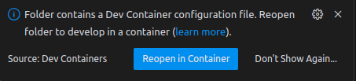

# Environment Setup

Two supported flows: a **virtual environment** (recommended for stable multi-day training) and a **Docker Dev Container** (recommended for reproducible development).

## Prerequisites

- Python 3.9
- One of: NVIDIA GPU with CUDA 12.1, Apple Silicon (MPS), or CPU
- Hugging Face Hub token (required for automatic ViT model downloads)
- Weights & Biases account + API key (evaluation results are logged exclusively to W&B)

## Platform support

| Install path | Linux + NVIDIA | Windows + NVIDIA (WSL2) | Apple Silicon Mac (M1/M2/M3/M4) | Intel Mac / other |
|---|---|---|---|---|
| **Virtual environment** (§3a) | ✅ `requirements.cuda_12_1.txt` | ✅ `requirements.cuda_12_1.txt` | ✅ `requirements.mps.txt` | CPU only (slow) |
| **Docker Dev Container** (§3b) | ✅ | ✅ via WSL2 + NVIDIA Container Toolkit | ❌ | ❌ |

The Docker image is built on a CUDA 12.1 base and the compose file requires `runtime: nvidia` — it will not start without an NVIDIA GPU visible to Docker. **Apple Silicon and any non-NVIDIA host must use the virtual environment path (§3a)**; Docker Desktop on macOS cannot expose the M-series GPU to containers.

## 1. Clone the repository

```bash
git clone https://github.com/pedroandreou/supreme-unlearning.git
```

## 2. Set up environment variables

Copy the template:

```bash
# Linux / macOS
cp .env.example .env

# Windows
xcopy .env.example .env
```

Update `.env` with your credentials.

**Required:**
- `HF_TOKEN` - Hugging Face Hub token for ViT downloads
- `WANDB_API_KEY` and W&B username - results are logged exclusively to W&B; no standalone JSON/CSV export

**Optional (Docker Dev Container only):**
- `GIT_USER_NAME`, `GIT_USER_EMAIL` - used to configure git inside the container

The Docker Dev container reads `.env` during the build, so create it **before** the build.

## 3a. Virtual environment (recommended)

```bash
# Ensure Python 3.9 is on PATH (use pyenv if needed)
python3.9 -m venv gpu_env
source gpu_env/bin/activate
```

Install dependencies - pick the file matching your hardware:

```bash
# NVIDIA GPU (CUDA 12.1) - Linux/cluster
pip install -r requirements.cuda_12_1.txt

# Apple Silicon Mac (MPS - M1/M2/M3/M4)
pip install -r requirements.mps.txt
```

The MPS requirements file uses the standard PyPI PyTorch build, which includes MPS support natively. `bitsandbytes` and `nvidia-ml-py` are omitted as they are CUDA-only.

Install the framework in editable mode:

```bash
pip install -e .
```

## 3b. Docker Dev Container (alternative)

> **Requires an NVIDIA GPU.** Linux or Windows + WSL2 only. Apple Silicon and other non-NVIDIA hosts: use §3a instead.

If you have VS Code and Docker installed, click the **Open in Dev Containers** badge in the README, or use the VS Code Dev Containers extension to reopen the repo in a container. You should see a prompt like this:



If the prompt has disappeared, use `View → Command Palette → Developer: Reload Window`, or `Dev Containers: Rebuild without Cache and Reopen in Container`.

The first build takes several minutes; subsequent builds use Docker cache. You may need to rebuild if CUDA becomes unavailable after extended use.

**Why we recommend the virtual environment for long runs:** the NVIDIA container runtime occasionally fails with *"Failed to initialize NVML: Unknown Error"* after prolonged GPU access. The official workaround is to set `no-cgroups = false` in `/etc/nvidia-container-runtime/config.toml`, which requires sudo on the host. The virtual environment avoids this entirely.

## 4. macOS-only: install bash 4+

`supreme/run_local.sh` uses bash 4 features (`mapfile`, etc.). macOS ships with bash 3.2.

```bash
brew install bash
# Then run experiments with:
/opt/homebrew/bin/bash supreme/run_local.sh --gpu 0 ...
```

## Verifying the install

```bash
python -c "import torch; print('torch', torch.__version__, '| cuda', torch.cuda.is_available(), '| mps', torch.backends.mps.is_available())"
python -c "from supreme.utils.unlearning import unlearn_main; print('SUPREME import OK')"
```

Then run a minimal smoke test - see [README → Running Experiments](../README.md#-running-experiments).
